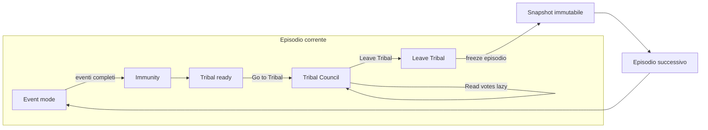

# SIMOA – Progetto di refactoring del motore

**Scopo**: Refactoring completo del motore di Simoa (simoa.js) senza perdere funzionalità. Il documento descrive problemi attuali, invarianti, modello dati, flusso e modifiche per modulo, e serve come specifica per l’implementazione.

---

## 1. Titolo e scopo

- **Titolo**: Refactoring completo del motore Simoa.
- **Scopo**: Risolvere i problemi di coerenza (stesso tribal per episodi diversi, voting history globale, tribal calcolato in anticipo, immutabilità episodi), mantenendo tutte le funzioni esistenti: setup, cast editor, import/export cast, eventi, immunity, tribal, finale, navigazione episodi, save/load.

---

## 2. Elenco problemi noti

Riferimento: comportamento attuale in `simoa.js`.

| Problema | Causa tecnica |
|----------|----------------|
| **Stesso tribal per ogni episodio** | Lo snapshot a volte salva `tribalBody.innerHTML` (o stato live); `saveSnapshot` può sovrascrivere il tribal di un episodio con quello di un altro. `loadLocal` ripristina `tribalBody.innerHTML` da `s.tribalHTML` invece che dal `tribalData` dell’episodio corrente. |
| **Voting history non per-episodio** | `renderVoteHistory()` usa sempre il globale `players`. Navigando a un episodio passato, la tabella mostra tutti i voti (anche degli episodi successivi). Manca una vista “per episodio” derivata dallo snapshot. |
| **Immutabilità non rispettata** | `loadLocal` non ricostruisce lo stato tribale dall’episodio corrente; si mescola DOM salvato con snapshot. In alcuni percorsi si può ancora scrivere o sovrascrivere dati di episodi già conclusi. |
| **Tribal calcolato subito** | `calculateVotes()` è invocato in `setupTribalUI()` al primo ingresso in tribal; l’esito è fissato prima del click su “Read First Vote”. Richiesta: niente generato/calcolato fino al click che mostra il risultato. |
| **Leave Tribal / Close tribal** | Event delegation su `#btn-end-tribal` c’è, ma i pulsanti ricreati da HTML (navigazione indietro, caricamento) richiedono contesto “episodio corrente vs passato” sempre coerente. |
| **Final Tribal / Jury** | Un voto per giurato e niente duplicati: già tentato con `uniqueJury` e `usedJurorIds`; va garantito in modo robusto e documentato. |
| **Import Cast** | Listener deve passare `e.target` a `importCastConfig`; opzioni tribù da `config.tribes`; dopo l’import mostrare il cast editor. Parsing robusto. |

---

## 3. Invarianti e principi

- **Episodi passati immutabili e in sola lettura**  
  Quando `currentEpisode` avanza (dopo “Leave Tribal” / fine episodio), tutto ciò che riguarda l’episodio precedente è congelato. Il record in `historyLog` per quell’episodio è l’unica fonte di verità. **Non si scrive mai** in `historyLog[ep]` per `ep < currentEpisode`.

- **Un solo episodio scrivibile**  
  Solo l’episodio `currentEpisode` può essere aggiornato. `saveSnapshot` aggiorna solo l’elemento di `historyLog` con `episode === currentEpisode`. Navigando a un episodio passato, l’UI (narrative, tribal, tabella voti) deve derivare **solo** dallo snapshot di quell’episodio.

- **Tribal come dati, non solo DOM**  
  Per ogni episodio che ha un tribal, lo snapshot contiene `tribalData` (logLines, votesRevealed, eliminated). L’HTML del tribal si costruisce sempre da `tribalData` (es. `buildTribalHtmlFromData`). Non si usa `tribalBody.innerHTML` come fonte di verità per gli episodi passati.

- **Lazy tribal**  
  Nessun calcolo dei voti fino al primo click che “mostra” il risultato (es. “Read First Vote”). Fino a quel momento la schermata tribal mostra solo un placeholder (“Il tribal è in corso…” / “Votes have been cast…”).

---

## 4. Modello dati

### 4.1 historyLog

- Array di snapshot, uno per episodio.
- Ogni elemento:
  - `episode` (numero)
  - `players` (copia dello stato giocatori a fine episodio)
  - `tribes`, `alliances`, `narrative`, `stage`
  - `tribalData`: `{ logLines[], votesRevealed[], eliminated }` se l’episodio ha avuto tribal; altrimenti `null`.
- `tribalHtml` non è fonte primaria; eventuale uso solo come fallback per salvataggi vecchi.

### 4.2 Stato “live” (episodio corrente)

- Variabili globali / sim: `players`, `tribes`, `alliances`, `currentEpisode`, `gameMode`, `episodeEventsCount`, `eventsTarget`, `isMerged`, ecc.
- Per tribal in corso: `tribalLogLines`, `tribalVotesRevealed`, `votesToRead`, `pendingBoot`, `tribalStage`, `tiedPlayers`, `immunityWinner`, `tribalTargetTribe`.
- I voti vengono calcolati solo al primo “Read First Vote” (lazy); un flag tipo `tribalVotesCalculated` indica se `calculateVotes()` è già stato eseguito per questo tribal.

---

## 5. Flusso episodi e tribal

- **Event**: eventi episodio; a fine target → Immunity.
- **Immunity**: determina tribù perdente / vincitore individuale; passa a TRIBAL_READY.
- **Tribal ready**: bottone “Go to Tribal Council” → entra in TRIBAL **senza** chiamare `calculateVotes()`.
- **Tribal Council**: UI mostrata; al primo “Read First Vote” si chiama `calculateVotes()` e si mostra il primo voto; poi `revealNextVote` per i successivi. “Leave Tribal” → `endTribal()`.
- **endTribal**: episodio appena concluso è già in historyLog; diventa **immutabile**. Si avanza `currentEpisode`, si resettano contatori e si passa a EVENT (o Merge / Finale se applicabile).

---

## 6. Modifiche per modulo

### 6.1 saveSnapshot

- Aggiornare **solo** l’elemento di `historyLog` con `episode === currentEpisode`.
- Se `gameMode === 'TRIBAL'` e c’è contenuto tribale (`tribalLogLines` / `tribalVotesRevealed`), costruire `tribalData` da questi e da `pendingBoot`; altrimenti mantenere il `tribalData` già presente nello snapshot (non sovrascrivere con DOM).
- Non usare `tribalBody.innerHTML` come fonte per gli episodi in historyLog.

### 6.2 loadLocal

- Ripristinare `historyLog`, `players`, `tribes`, `alliances`, `currentEpisode`, `gameMode`, ecc.
- Se `gameMode === 'TRIBAL'`: ricostruire lo stato tribale dell’episodio corrente da `historyLog[currentEpisode].tribalData` e da `votesToRead`, `pendingBoot`, `tribalStage`, `tiedPlayers` se persistiti; impostare `tribalBody.innerHTML` tramite `buildTribalHtmlFromData`; ripristinare `tribalLogLines` e `tribalVotesRevealed` dallo snapshot. **Non** usare `s.tribalHTML` come unica fonte per il tribal.

### 6.3 navEpisode

- **Se `target !== currentEpisode`** (episodio passato, sola lettura):
  - Narrative: `snap.narrative`.
  - Tribal: da `snap.tribalData` → `buildTribalHtmlFromData(snap.tribalData)`; fallback a `snap.tribalHtml` per salvataggi vecchi.
  - **Tabella voting history**: derivarla dallo snapshot (es. da `snap.players` e dai loro `history` con `ep <= snap.episode`, oppure struttura “voteMatrix” nello snapshot). Non usare il globale `players`.
  - Pulsante: “Close tribal view” (solo chiude overlay).
- **Se `target === currentEpisode`**: narrative e tribal come oggi; voting history dal globale `players`; se `gameMode === 'TRIBAL'` mostrare “Leave Tribal” e “Read First Vote”.

### 6.4 Tribal (lazy)

- **“Go to Tribal Council”**: entra in modalità TRIBAL, mostra UI tribale, **non** chiamare `calculateVotes()`.
- **setupTribalUI**: inizializzare `tribalLogLines`, `tribalVotesRevealed`, nascondere bottone principale, mostrare sezione tribal e placeholder (“Votes have been cast…”). **Non** chiamare `calculateVotes()`. Impostare flag `tribalVotesCalculated = false`.
- **“Read First Vote”** (primo click): se `!tribalVotesCalculated`, chiamare `calculateVotes()`, impostare `tribalVotesCalculated = true`; poi mostrare il primo voto (stesso flusso di `revealNextVote`). Click successivi: solo `revealNextVote`.

### 6.5 Final Tribal / Jury

- `jury`: array senza duplicati (es. `[...new Set(this.jury)]` in save e dopo load).
- `runFinale`: costruire `finaleVotes` con **un solo** entry per juror (es. `uniqueJury`, `usedJurorIds`); nessun doppio voto.
- Salvataggio/caricamento: persistenza di `jury` e `finaleVotes`; dopo load ripristinare e deduplicare jury.

### 6.6 UI

- Voting history: nomi giocatori attivi leggibili (es. colore `#0e2638`).
- Advantages in play: pulsanti/testo leggibili (contrasto sufficiente).
- “Leave Tribal” vs “Close tribal view” in base a `viewingEpisode === currentEpisode`.
- Cast editor / Tribe Customization: stile allineato (simoa-input-group), una riga per player, label stat estese (Physical, Strategy, Social, Loyalty, Intuition, Temper), layout responsive.

### 6.7 Import Cast

- Listener `change` sul file input che passa `e.target` a `importCastConfig` (non l’evento).
- Generazione opzioni tribù da `config.tribes` (es. `generateTribeOptionsFromConfig`).
- Parsing robusto (JSON, presenza di `players` e `tribes`); messaggio di successo; mostrare cast editor dopo l’import.

---

## 7. Regole tribal

- **Un nome letto per volta**: ogni click su “Read (Next) Vote” rivela un solo voto; log e `votesRevealed` aggiornati di conseguenza.
- **Idolo**: annulla i voti contro il giocatore che lo gioca; se il giocatore con più voti ha giocato l’idolo, si elimina chi ha la **seconda** maggioranza di voti (se esiste e ha voti > 0); altrimenti regole di fallback (es. più basso social score tra i vulnerabili).
- **Parità**: si va a revote (solo tra i pari); se dopo il revote è ancora parità → deadlock.
- **Deadlock**: a 4 giocatori → Fire Making Challenge; altrimenti → rocks (immuni: immunity winner + tied players); chi pesca la roccia nera è eliminato.
- La logica resta in un unico punto (es. `calculateVotes`) e va documentata in commenti nel codice.

---

## 8. Checklist funzionalità (da non perdere)

- [ ] **Setup**: numero giocatori, tribù, merge, swap, nome/colore merge; configurazione tribù (nome, colore).
- [ ] **Cast editor**: una riga per player; nome, genere, tribù, stat (Physical, Strategy, Social, Loyalty, Intuition, Temper); randomize, fill names, balance tribes.
- [ ] **Import/Export cast**: export JSON (players + tribes + seasonName); import con parsing robusto e opzioni tribù da config; messaggio successo e visualizzazione cast editor.
- [ ] **Eventi episodio**: eventi da EVENTS_DB, relazioni, idoli, alleanze, medevac, swap.
- [ ] **Immunity**: tribù perdente (pre-merge) o vincitore individuale (merge); log evento.
- [ ] **Tribal**: Go to Tribal → UI senza calcolo; Read First Vote → calculateVotes + primo voto; reveal successivi; idolo, revote, deadlock, rocks/fire; log e eliminated; Leave Tribal.
- [ ] **Finale**: finalisti, jury, un voto per giurato, lettura voti, annuncio vincitore.
- [ ] **Navigazione episodi**: prev/next; episodio passato = sola lettura (narrative, tribal da tribalData, voting history da snapshot); episodio corrente = stato live; pulsanti Leave Tribal / Close tribal view coerenti.
- [ ] **Resume / Save / Load**: salvataggio in localStorage; load ricostruisce stato e, se TRIBAL, tribal da snapshot corrente; nessuna sovrascrittura di episodi passati.

---

*Documento di specifica per il refactoring del motore Simoa. File: SIMOA_RF.md*
